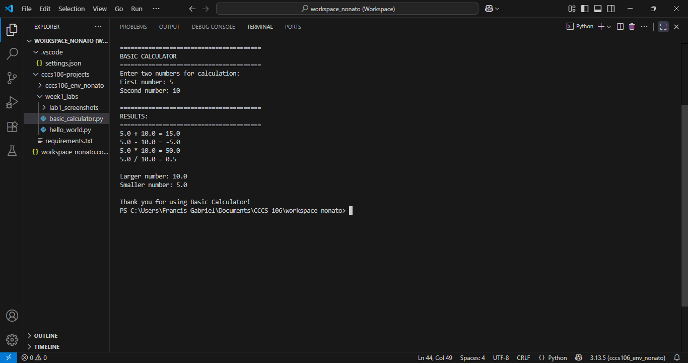
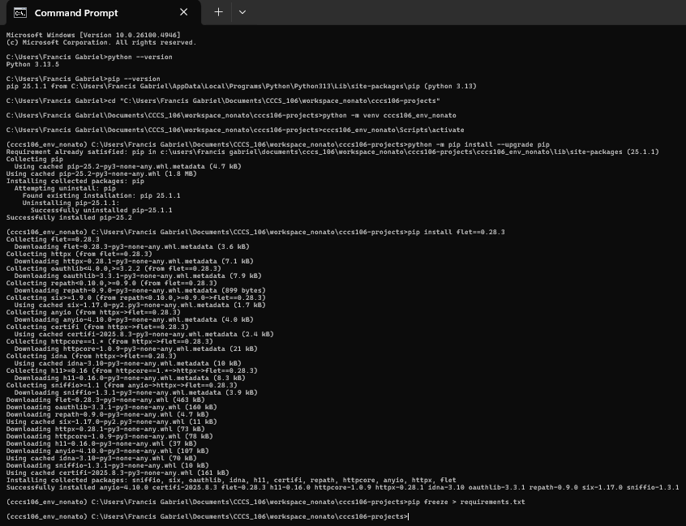
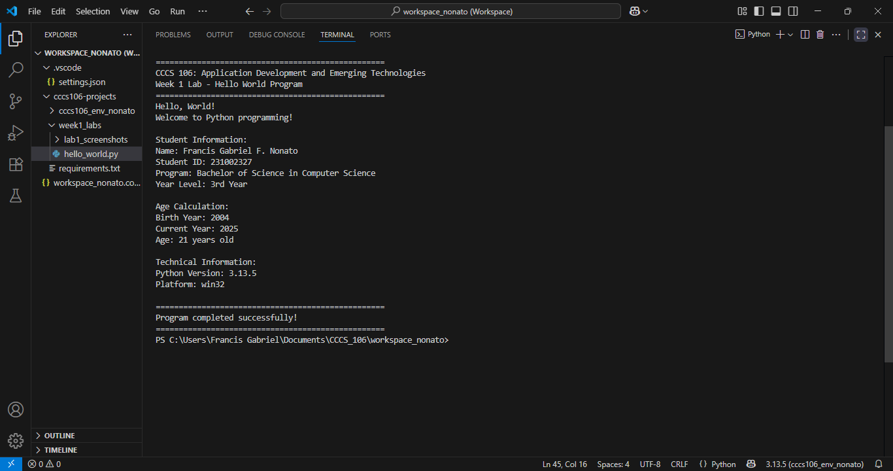
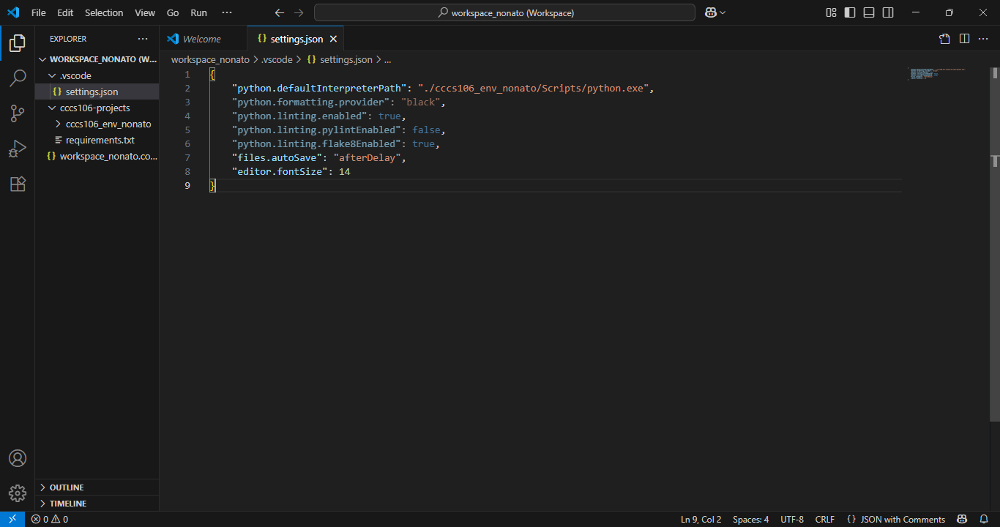

# Lab 1 Report: Environment Setup and Python Basics

**Student Name:** Francis Gabriel F. Nonato
**Student ID:** 231002327
**Section:** 3A
**Date:** August 31, 2025

## Environment Setup

### Python Installation
- **Python Version:** 3.13.5
- **Installation Issues:** I have not encountered any installation issues whatsoever.
- **Virtual Environment Created:** ✅ cccs106_env_nonato

### VS Code Configuration
- **VS Code Version:** 1.103.2
- **Python Extension:** ✅ Installed and configured
- **Interpreter:** ✅ Set to cccs106_env_nonato/Scripts/python.exe

### Package Installation
- **Flet Version:** 0.28.3
- **Other Packages:** requirements.txt

## Programs Created

### 1. hello_world.py
- **Status:** ✅ Completed
- **Features:** Student info display, age calculation, system info
- **Notes:** Does not display accurate age.

### 2. basic_calculator.py
- **Status:** ✅ Completed
- **Features:** Basic arithmetic, error handling, min/max calculation
- **Notes:** It is a simple calculator that everyone can use.

## Challenges and Solutions

Have encountered environment and interpreter problems and fixed it by checking my folder structure/workspace and redoing it.

## Learning Outcomes

I learned that maintaining a good structure of the workspace can easily make the project look neat and make it more understandable.

## Screenshots

