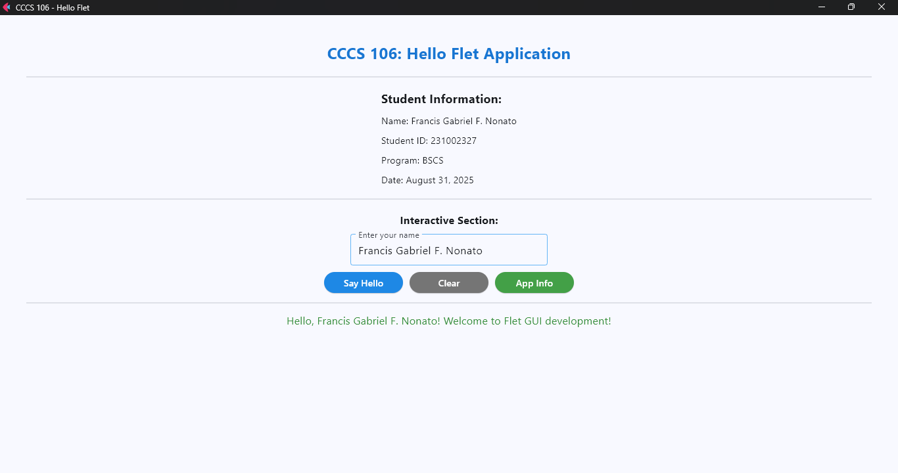
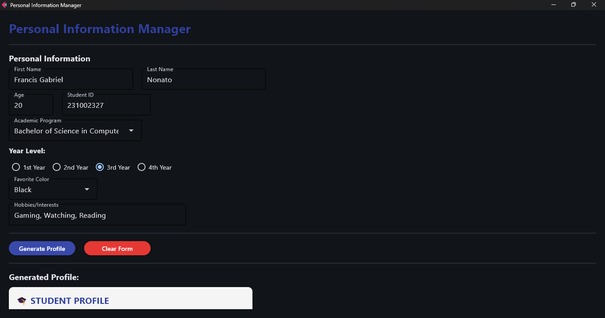

# Lab 2 Report: Git Version Control and Flet GUI Development

**Student Name:** Francis Gabriel F. Nonato
**Student ID:** 231002327
**Section:** 3A
**Date:** August 31, 2025

## Git Configuration

### Repository Setup
- **GitHub Repository:** [cccs106-projects](https://github.com/frnonato-lgtm/cccs106-projects)
- **Local Repository:** ✅ Initialized and connected
- **Commit History:** [5] commits with descriptive messages

### Git Skills Demonstrated
- ✅ Repository initialization and configuration
- ✅ Adding, committing, and pushing changes
- ✅ Branch creation and merging
- ✅ Remote repository management

## Flet GUI Applications

### 1. hello_flet.py
- **Status:** ✅ Completed
- **Features:** Interactive greeting, student info display, dialog boxes
- **UI Components:** Text, TextField, Buttons, Dialog, Containers
- **Notes:** It took too long to run the program.

### 2. personal_info_gui.py
- **Status:** ✅ Completed
- **Features:** Form inputs, dropdowns, radio buttons, profile generation
- **UI Components:** TextField, Dropdown, RadioGroup, Containers, Scrolling
- **Error Handling:** Input validation and user feedback
- **Notes:** The text on the profile generation is too hard to see in dark mode.

## Technical Skills Developed

### Git Version Control
- Understanding of repository concepts
- Basic Git workflow (add, commit, push)
- Branch management and merging
- Remote repository collaboration

### Flet GUI Development
- Flet 0.28.3 syntax and components
- Page configuration and layout management
- Event handling and user interaction
- Modern UI design principles

## Challenges and Solutions

The two Python programs took too long to run, and I fixed it by changing some settings in PowerShell and running the program again while waiting, which was successful.

## Learning Outcomes

I learned that installing the correct framework, like Flet, and creating a program with it is convenient when it comes to developing simple applications.

## Screenshots

### Git Repository
- [ ] GitHub repository with commit history
- [ ] Local git log showing commits

### GUI Applications
- [ ] hello_flet.py running with all features
- [ ] personal_info_gui.py with filled form and generated profile

## Future Enhancements

As of now, I have no ideas for improving or adding additional features to these programs.